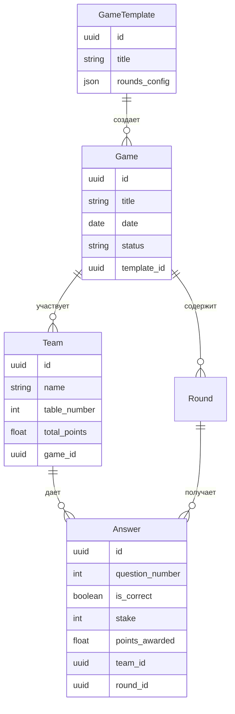

# 🏗️ Архитектура Quiz Game (простая версия)

> **Для**: Разработчиков | **Время чтения**: 10 минут | **Уровень**: Базовый

## 🎯 Что это за система?

Quiz Game - это веб-приложение для проведения интеллектуальных игр с автоматическим подсчетом баллов и real-time табло.

### Основные функции
- 📝 Создание игр из шаблонов
- 👥 Управление командами
- 🎯 Ввод ответов и подсчет баллов
- 📊 Real-time табло для зрителей
- 📈 Статистика команд

## 🧩 Компоненты системы

```
┌─────────────────┐    ┌─────────────────┐    ┌─────────────────┐
│   Frontend      │    │    Backend      │    │   Database      │
│   (React)       │◄──►│  (Node.js)      │◄──►│ (PostgreSQL)    │
│                 │    │                 │    │                 │
│ • Admin Panel   │    │ • REST API      │    │ • Games         │
│ • Public Board  │    │ • WebSocket     │    │ • Teams         │
│ • Forms         │    │ • Auth          │    │ • Scores        │
└─────────────────┘    └─────────────────┘    └─────────────────┘
```

## 📊 Схема данных (упрощенная)



## 🔄 Основные процессы

### 1. Создание игры
```
Admin → Frontend → API → Database
1. Выбирает шаблон игры
2. Добавляет команды
3. Система создает игру и раунды
4. Генерируется табло
```

### 2. Ввод баллов
```
Admin → Frontend → API → Database → WebSocket → Public Board
1. Админ вводит результат ответа
2. Система рассчитывает баллы
3. Обновляет общий счет команды
4. Отправляет обновление на табло
```

### 3. Просмотр табло
```
Spectator → Frontend → API → Database
1. Открывает публичное табло
2. Получает текущие результаты
3. Подписывается на WebSocket обновления
4. Видит изменения в реальном времени
```

## 🛠️ Технологический стек

### Frontend
- **React 19** - UI библиотека
- **TypeScript** - типизация
- **Material-UI** - компоненты
- **Socket.IO Client** - WebSocket
- **Vite** - сборка

### Backend  
- **Node.js 18+** - runtime
- **Express.js** - веб-фреймворк
- **Sequelize** - ORM
- **Socket.IO** - WebSocket сервер
- **JWT** - аутентификация

### Database
- **PostgreSQL 15+** - основная БД
- **JSON fields** - гибкие настройки
- **UUID** - первичные ключи

### DevOps
- **Docker** - контейнеризация
- **GitHub Actions** - CI/CD
- **PM2** - process manager

## 🔌 API Endpoints (основные)

```
# Игры
GET    /api/games                    # Список игр
POST   /api/games                    # Создать игру
GET    /api/games/:id                # Детали игры
GET    /api/games/:id/scoreboard     # Табло игры

# Команды
GET    /api/teams                    # Список команд
POST   /api/teams                    # Создать команду

# Баллы
POST   /api/scores                   # Обновить баллы
GET    /api/games/:id/scores         # История баллов

# WebSocket события
score:updated                        # Обновление баллов
game:status:changed                  # Изменение статуса игры
```

## 🔐 Безопасность (базовая)

### Аутентификация
- JWT токены для админов
- Публичный доступ к табло (без auth)
- Rate limiting на API

### Валидация
- Проверка входных данных
- Sanitization пользовательского ввода
- CORS настройки

## 📈 Производительность

### Ожидаемые нагрузки (MVP)
- **Админы**: 1-5 одновременных пользователей
- **Зрители**: 50-200 одновременных подключений
- **Игры**: 1-10 активных игр одновременно
- **Команды**: до 20 команд в игре

### Оптимизации
- WebSocket для real-time обновлений
- Кеширование статических данных
- Индексы БД для частых запросов
- Pagination для больших списков

## 🚀 Развертывание

### Development
```bash
# Локальная разработка
npm run dev:backend    # Backend на :5001
npm run dev:frontend   # Frontend на :3000
```

### Production
```bash
# Docker Compose
docker-compose up -d
# Backend на :5000, Frontend на :80
```

## 🔄 Планы развития

### Фаза 1 (MVP) - 2 месяца
- ✅ Базовый функционал
- ✅ Простое табло
- 🔄 Тестирование

### Фаза 2 - 2 месяца  
- 📱 Мобильная версия
- 📊 Расширенная аналитика
- 🔐 Улучшенная безопасность

### Фаза 3 - 3 месяца
- 🌐 Многоязычность
- 🔗 Интеграции (Slack, Teams)
- ⚡ Масштабирование

## ❓ Частые вопросы

**Q: Почему PostgreSQL, а не MongoDB?**
A: Нужны ACID транзакции для корректного подсчета баллов.

**Q: Зачем WebSocket, если можно polling?**
A: Real-time обновления табло критичны для пользовательского опыта.

**Q: Почему не микросервисы?**
A: MVP не требует такой сложности, монолит проще поддерживать.

**Q: Масштабируется ли система?**
A: Да, архитектура позволяет горизонтальное масштабирование backend.

---

## 🔗 Следующие шаги

1. 🔧 [Настроить среду разработки](./development-setup.md)
2. 🌐 [Изучить API](./api-quick.md)
3. 🎨 [Frontend разработка](./frontend-guide.md)
4. ⚙️ [Backend разработка](./backend-guide.md)

---

> 💡 **Совет**: Это упрощенная версия архитектуры. Детальные диаграммы и спецификации доступны в полной документации.
