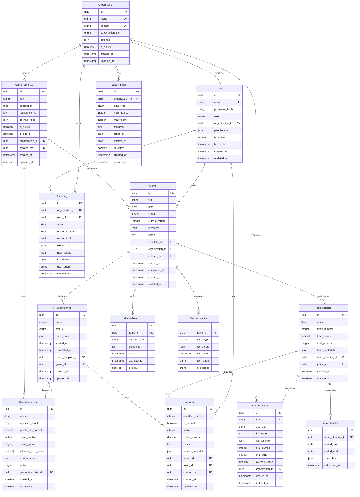

# 🗄️ База данных - Схема и миграции

> **Для**: Backend разработчиков, DBA | **Время**: 20 минут | **Enterprise-ready**

## 🎯 Обзор базы данных

Quiz Game использует **PostgreSQL 15+** как основную СУБД с enterprise-подходом к проектированию:
- **ACID транзакции** для корректности данных
- **UUID первичные ключи** для масштабирования
- **JSON поля** для гибкости конфигураций
- **Партиционирование** для больших объемов данных
- **Репликация** для высокой доступности

## 📊 Enterprise ER-диаграмма



## 🏗️ Создание схемы базы данных

### 1. Инициализация PostgreSQL
```sql
-- Создание базы данных
CREATE DATABASE quiz_game_enterprise 
  WITH ENCODING 'UTF8' 
  LC_COLLATE='en_US.UTF-8' 
  LC_CTYPE='en_US.UTF-8';

-- Подключение к БД
\c quiz_game_enterprise;

-- Создание расширений
CREATE EXTENSION IF NOT EXISTS "uuid-ossp";
CREATE EXTENSION IF NOT EXISTS "pg_stat_statements";
CREATE EXTENSION IF NOT EXISTS "pg_trgm";

-- Создание схем
CREATE SCHEMA IF NOT EXISTS core;
CREATE SCHEMA IF NOT EXISTS analytics;
CREATE SCHEMA IF NOT EXISTS audit;
```

### 2. Основные таблицы
```sql
-- Organizations (мультитенантность)
CREATE TABLE core.organizations (
    id UUID PRIMARY KEY DEFAULT uuid_generate_v4(),
    name VARCHAR(200) UNIQUE NOT NULL,
    domain VARCHAR(100) UNIQUE NOT NULL,
    subscription_tier VARCHAR(50) DEFAULT 'basic',
    settings JSONB DEFAULT '{}',
    is_active BOOLEAN DEFAULT true,
    created_at TIMESTAMP WITH TIME ZONE DEFAULT NOW(),
    updated_at TIMESTAMP WITH TIME ZONE DEFAULT NOW()
);

-- Users (enterprise аутентификация)
CREATE TABLE core.users (
    id UUID PRIMARY KEY DEFAULT uuid_generate_v4(),
    email VARCHAR(255) UNIQUE NOT NULL,
    password_hash VARCHAR(255) NOT NULL,
    role VARCHAR(50) DEFAULT 'user',
    organization_id UUID NOT NULL REFERENCES core.organizations(id),
    permissions JSONB DEFAULT '{}',
    is_active BOOLEAN DEFAULT true,
    last_login TIMESTAMP WITH TIME ZONE,
    created_at TIMESTAMP WITH TIME ZONE DEFAULT NOW(),
    updated_at TIMESTAMP WITH TIME ZONE DEFAULT NOW()
);

-- Game Templates
CREATE TABLE core.game_templates (
    id UUID PRIMARY KEY DEFAULT uuid_generate_v4(),
    title VARCHAR(200) NOT NULL,
    description TEXT,
    rounds_config JSONB NOT NULL,
    scoring_rules JSONB DEFAULT '{}',
    is_active BOOLEAN DEFAULT true,
    is_public BOOLEAN DEFAULT false,
    organization_id UUID NOT NULL REFERENCES core.organizations(id),
    created_by UUID REFERENCES core.users(id),
    created_at TIMESTAMP WITH TIME ZONE DEFAULT NOW(),
    updated_at TIMESTAMP WITH TIME ZONE DEFAULT NOW()
);

-- Round Templates  
CREATE TABLE core.round_templates (
    id UUID PRIMARY KEY DEFAULT uuid_generate_v4(),
    name VARCHAR(100) NOT NULL,
    question_count INTEGER NOT NULL CHECK (question_count > 0 AND question_count <= 100),
    points_per_correct DECIMAL(4,1) NOT NULL CHECK (points_per_correct >= 0.1 AND points_per_correct <= 20.0),
    stake_enabled BOOLEAN DEFAULT false,
    stake_options INTEGER[] DEFAULT '{}',
    allowed_point_values DECIMAL[] DEFAULT '{}',
    custom_rules JSONB DEFAULT '{}',
    "order" INTEGER NOT NULL CHECK ("order" > 0),
    game_template_id UUID NOT NULL REFERENCES core.game_templates(id) ON DELETE CASCADE,
    created_at TIMESTAMP WITH TIME ZONE DEFAULT NOW(),
    updated_at TIMESTAMP WITH TIME ZONE DEFAULT NOW()
);

-- Games
CREATE TABLE core.games (
    id UUID PRIMARY KEY DEFAULT uuid_generate_v4(),
    title VARCHAR(200) NOT NULL,
    date DATE NOT NULL,
    status VARCHAR(50) DEFAULT 'created',
    current_round INTEGER DEFAULT 1,
    metadata JSONB DEFAULT '{}',
    notes TEXT,
    template_id UUID NOT NULL REFERENCES core.game_templates(id),
    organization_id UUID NOT NULL REFERENCES core.organizations(id),
    created_by UUID REFERENCES core.users(id),
    started_at TIMESTAMP WITH TIME ZONE,
    completed_at TIMESTAMP WITH TIME ZONE,
    created_at TIMESTAMP WITH TIME ZONE DEFAULT NOW(),
    updated_at TIMESTAMP WITH TIME ZONE DEFAULT NOW()
);

-- Team Directory
CREATE TABLE core.team_directories (
    id UUID PRIMARY KEY DEFAULT uuid_generate_v4(),
    name VARCHAR(100) NOT NULL,
    logo_path VARCHAR(500),
    description TEXT,
    contact_info JSONB DEFAULT '{}',
    total_games INTEGER DEFAULT 0,
    total_wins INTEGER DEFAULT 0,
    average_score DECIMAL(6,2) DEFAULT 0.00,
    organization_id UUID NOT NULL REFERENCES core.organizations(id),
    created_at TIMESTAMP WITH TIME ZONE DEFAULT NOW(),
    updated_at TIMESTAMP WITH TIME ZONE DEFAULT NOW(),
    UNIQUE(organization_id, name)
);

-- Team Instances
CREATE TABLE core.team_instances (
    id UUID PRIMARY KEY DEFAULT uuid_generate_v4(),
    name VARCHAR(100) NOT NULL,
    table_number INTEGER NOT NULL CHECK (table_number > 0),
    total_points DECIMAL(8,1) DEFAULT 0.0,
    final_position INTEGER,
    team_metadata JSONB DEFAULT '{}',
    team_directory_id UUID REFERENCES core.team_directories(id),
    game_id UUID NOT NULL REFERENCES core.games(id) ON DELETE CASCADE,
    created_at TIMESTAMP WITH TIME ZONE DEFAULT NOW(),
    updated_at TIMESTAMP WITH TIME ZONE DEFAULT NOW(),
    UNIQUE(game_id, table_number)
);

-- Round Instances
CREATE TABLE core.round_instances (
    id UUID PRIMARY KEY DEFAULT uuid_generate_v4(),
    "order" INTEGER NOT NULL CHECK ("order" > 0),
    status VARCHAR(50) DEFAULT 'pending',
    round_data JSONB DEFAULT '{}',
    started_at TIMESTAMP WITH TIME ZONE,
    completed_at TIMESTAMP WITH TIME ZONE,
    round_template_id UUID NOT NULL REFERENCES core.round_templates(id),
    game_id UUID NOT NULL REFERENCES core.games(id) ON DELETE CASCADE,
    created_at TIMESTAMP WITH TIME ZONE DEFAULT NOW(),
    updated_at TIMESTAMP WITH TIME ZONE DEFAULT NOW(),
    UNIQUE(game_id, "order")
);

-- Answers (партиционированная таблица)
CREATE TABLE core.answers (
    id UUID PRIMARY KEY DEFAULT uuid_generate_v4(),
    question_number INTEGER NOT NULL CHECK (question_number > 0 AND question_number <= 100),
    is_correct BOOLEAN NOT NULL,
    stake INTEGER CHECK (stake >= 1 AND stake <= 10),
    points_awarded DECIMAL(6,1) NOT NULL DEFAULT 0.0,
    notes TEXT,
    answer_metadata JSONB DEFAULT '{}',
    round_id UUID NOT NULL REFERENCES core.round_instances(id) ON DELETE CASCADE,
    team_id UUID NOT NULL REFERENCES core.team_instances(id) ON DELETE CASCADE,
    created_by UUID REFERENCES core.users(id),
    created_at TIMESTAMP WITH TIME ZONE DEFAULT NOW(),
    updated_at TIMESTAMP WITH TIME ZONE DEFAULT NOW()
) PARTITION BY RANGE (created_at);

-- Партиции для answers (по месяцам)
CREATE TABLE core.answers_2025_01 PARTITION OF core.answers
    FOR VALUES FROM ('2025-01-01') TO ('2025-02-01');
CREATE TABLE core.answers_2025_02 PARTITION OF core.answers
    FOR VALUES FROM ('2025-02-01') TO ('2025-03-01');
-- ... создаем партиции на год вперед
```

### 3. Enterprise таблицы
```sql
-- Game Sessions (для WebSocket соединений)
CREATE TABLE core.game_sessions (
    id UUID PRIMARY KEY DEFAULT uuid_generate_v4(),
    game_id UUID NOT NULL REFERENCES core.games(id) ON DELETE CASCADE,
    session_token VARCHAR(255) UNIQUE NOT NULL,
    client_info JSONB DEFAULT '{}',
    started_at TIMESTAMP WITH TIME ZONE DEFAULT NOW(),
    last_activity TIMESTAMP WITH TIME ZONE DEFAULT NOW(),
    is_active BOOLEAN DEFAULT true
);

-- Analytics (партиционированная)
CREATE TABLE analytics.game_analytics (
    id UUID PRIMARY KEY DEFAULT uuid_generate_v4(),
    game_id UUID NOT NULL,
    event_type VARCHAR(100) NOT NULL,
    event_data JSONB DEFAULT '{}',
    event_time TIMESTAMP WITH TIME ZONE DEFAULT NOW(),
    user_agent TEXT,
    ip_address INET
) PARTITION BY RANGE (event_time);

-- Team Statistics (агрегированная статистика)
CREATE TABLE analytics.team_statistics (
    id UUID PRIMARY KEY DEFAULT uuid_generate_v4(),
    team_directory_id UUID NOT NULL REFERENCES core.team_directories(id),
    period_start DATE NOT NULL,
    period_end DATE NOT NULL,
    stats_data JSONB NOT NULL,
    calculated_at TIMESTAMP WITH TIME ZONE DEFAULT NOW()
);

-- Audit Log (партиционированная)
CREATE TABLE audit.audit_logs (
    id UUID PRIMARY KEY DEFAULT uuid_generate_v4(),
    organization_id UUID NOT NULL REFERENCES core.organizations(id),
    user_id UUID REFERENCES core.users(id),
    action VARCHAR(100) NOT NULL,
    resource_type VARCHAR(100) NOT NULL,
    resource_id UUID,
    old_values JSONB,
    new_values JSONB,
    ip_address INET,
    user_agent TEXT,
    created_at TIMESTAMP WITH TIME ZONE DEFAULT NOW()
) PARTITION BY RANGE (created_at);

-- Subscriptions
CREATE TABLE core.subscriptions (
    id UUID PRIMARY KEY DEFAULT uuid_generate_v4(),
    organization_id UUID NOT NULL REFERENCES core.organizations(id),
    plan_type VARCHAR(50) NOT NULL,
    max_games INTEGER NOT NULL,
    max_teams INTEGER NOT NULL,
    features JSONB DEFAULT '{}',
    starts_at DATE NOT NULL,
    expires_at DATE NOT NULL,
    is_active BOOLEAN DEFAULT true,
    created_at TIMESTAMP WITH TIME ZONE DEFAULT NOW(),
    updated_at TIMESTAMP WITH TIME ZONE DEFAULT NOW()
);
```

## 🚀 Индексы и производительность

### Основные индексы
```sql
-- Organizations
CREATE INDEX idx_organizations_domain ON core.organizations(domain);
CREATE INDEX idx_organizations_active ON core.organizations(is_active) WHERE is_active = true;

-- Users
CREATE INDEX idx_users_email ON core.users(email);
CREATE INDEX idx_users_organization ON core.users(organization_id);
CREATE INDEX idx_users_role ON core.users(role);
CREATE INDEX idx_users_active ON core.users(is_active) WHERE is_active = true;

-- Games
CREATE INDEX idx_games_organization ON core.games(organization_id);
CREATE INDEX idx_games_date ON core.games(date);
CREATE INDEX idx_games_status ON core.games(status);
CREATE INDEX idx_games_template ON core.games(template_id);
CREATE INDEX idx_games_created_by ON core.games(created_by);

-- Team Instances
CREATE INDEX idx_team_instances_game ON core.team_instances(game_id);
CREATE INDEX idx_team_instances_directory ON core.team_instances(team_directory_id);
CREATE INDEX idx_team_instances_points ON core.team_instances(total_points DESC);

-- Answers
CREATE INDEX idx_answers_round ON core.answers(round_id);
CREATE INDEX idx_answers_team ON core.answers(team_id);
CREATE INDEX idx_answers_question ON core.answers(question_number);
CREATE INDEX idx_answers_created_at ON core.answers(created_at);

-- Составные индексы для частых запросов
CREATE INDEX idx_games_org_status_date ON core.games(organization_id, status, date);
CREATE INDEX idx_answers_team_round ON core.answers(team_id, round_id);

-- GIN индексы для JSONB
CREATE INDEX idx_game_templates_config ON core.game_templates USING GIN(rounds_config);
CREATE INDEX idx_teams_metadata ON core.team_instances USING GIN(team_metadata);
CREATE INDEX idx_analytics_data ON analytics.game_analytics USING GIN(event_data);

-- Полнотекстовый поиск
CREATE INDEX idx_teams_name_search ON core.team_directories USING GIN(to_tsvector('russian', name));
CREATE INDEX idx_games_title_search ON core.games USING GIN(to_tsvector('russian', title));
```

## 🔄 Миграции (Sequelize)

### Структура миграций
```bash
database/
├── migrations/
│   ├── 20250127000001-create-organizations.js
│   ├── 20250127000002-create-users.js
│   ├── 20250127000003-create-game-templates.js
│   ├── 20250127000004-create-round-templates.js
│   ├── 20250127000005-create-games.js
│   ├── 20250127000006-create-team-directories.js
│   ├── 20250127000007-create-team-instances.js
│   ├── 20250127000008-create-round-instances.js
│   ├── 20250127000009-create-answers.js
│   ├── 20250127000010-create-sessions.js
│   ├── 20250127000011-create-analytics.js
│   ├── 20250127000012-create-audit-logs.js
│   └── 20250127000013-create-subscriptions.js
├── seeders/
│   ├── 20250127000001-demo-organizations.js
│   ├── 20250127000002-demo-users.js
│   └── 20250127000003-demo-templates.js
└── config/
    └── database.js
```

### Пример миграции
```javascript
// migrations/20250127000001-create-organizations.js
'use strict';

module.exports = {
  async up(queryInterface, Sequelize) {
    await queryInterface.createSchema('core');
    
    await queryInterface.createTable('core.organizations', {
      id: {
        type: Sequelize.UUID,
        primaryKey: true,
        defaultValue: Sequelize.UUIDV4
      },
      name: {
        type: Sequelize.STRING(200),
        allowNull: false,
        unique: true
      },
      domain: {
        type: Sequelize.STRING(100),
        allowNull: false,
        unique: true
      },
      subscription_tier: {
        type: Sequelize.STRING(50),
        defaultValue: 'basic'
      },
      settings: {
        type: Sequelize.JSONB,
        defaultValue: {}
      },
      is_active: {
        type: Sequelize.BOOLEAN,
        defaultValue: true
      },
      created_at: {
        type: Sequelize.DATE,
        allowNull: false,
        defaultValue: Sequelize.NOW
      },
      updated_at: {
        type: Sequelize.DATE,
        allowNull: false,
        defaultValue: Sequelize.NOW
      }
    });

    // Индексы
    await queryInterface.addIndex('core.organizations', ['domain']);
    await queryInterface.addIndex('core.organizations', ['is_active'], {
      where: { is_active: true }
    });
  },

  async down(queryInterface, Sequelize) {
    await queryInterface.dropTable('core.organizations');
    await queryInterface.dropSchema('core');
  }
};
```

## 🌱 Сиды для разработки

### Demo организация
```javascript
// seeders/20250127000001-demo-organizations.js
'use strict';

module.exports = {
  async up(queryInterface, Sequelize) {
    await queryInterface.bulkInsert('core.organizations', [
      {
        id: '550e8400-e29b-41d4-a716-446655440000',
        name: 'Demo Organization',
        domain: 'demo.quiz-game.com',
        subscription_tier: 'enterprise',
        settings: JSON.stringify({
          max_concurrent_games: 10,
          custom_branding: true,
          analytics_enabled: true
        }),
        is_active: true,
        created_at: new Date(),
        updated_at: new Date()
      }
    ]);
  },

  async down(queryInterface, Sequelize) {
    await queryInterface.bulkDelete('core.organizations', null, {});
  }
};
```

## 📊 Мониторинг и аналитика

### Представления для аналитики
```sql
-- Статистика игр по организациям
CREATE VIEW analytics.games_summary AS
SELECT 
    o.name as organization_name,
    COUNT(g.id) as total_games,
    COUNT(CASE WHEN g.status = 'completed' THEN 1 END) as completed_games,
    AVG(CASE WHEN g.completed_at IS NOT NULL 
        THEN EXTRACT(EPOCH FROM (g.completed_at - g.started_at))/3600 
    END) as avg_duration_hours
FROM core.organizations o
LEFT JOIN core.games g ON o.id = g.organization_id
GROUP BY o.id, o.name;

-- Топ команды по очкам
CREATE VIEW analytics.top_teams AS
SELECT 
    td.name as team_name,
    td.organization_id,
    COUNT(ti.id) as games_played,
    AVG(ti.total_points) as avg_points,
    MAX(ti.total_points) as max_points,
    COUNT(CASE WHEN ti.final_position = 1 THEN 1 END) as wins
FROM core.team_directories td
LEFT JOIN core.team_instances ti ON td.id = ti.team_directory_id
GROUP BY td.id, td.name, td.organization_id
HAVING COUNT(ti.id) > 0
ORDER BY avg_points DESC;

-- Активность по дням
CREATE VIEW analytics.daily_activity AS
SELECT 
    DATE(g.created_at) as game_date,
    g.organization_id,
    COUNT(g.id) as games_created,
    COUNT(DISTINCT g.created_by) as unique_users
FROM core.games g
WHERE g.created_at >= CURRENT_DATE - INTERVAL '30 days'
GROUP BY DATE(g.created_at), g.organization_id
ORDER BY game_date DESC;
```

## 🔧 Команды для работы с БД

### Основные команды
```bash
# Создание миграции
npx sequelize-cli migration:generate --name add-new-feature

# Запуск миграций
npx sequelize-cli db:migrate

# Откат миграции
npx sequelize-cli db:migrate:undo

# Запуск сидов
npx sequelize-cli db:seed:all

# Создание бэкапа
pg_dump -h localhost -U quiz_user -d quiz_game_enterprise > backup.sql

# Восстановление из бэкапа
psql -h localhost -U quiz_user -d quiz_game_enterprise < backup.sql
```

### Полезные SQL запросы
```sql
-- Проверка размера таблиц
SELECT 
    schemaname,
    tablename,
    pg_size_pretty(pg_total_relation_size(schemaname||'.'||tablename)) as size
FROM pg_tables 
WHERE schemaname IN ('core', 'analytics', 'audit')
ORDER BY pg_total_relation_size(schemaname||'.'||tablename) DESC;

-- Активные соединения
SELECT count(*) as connections, usename, application_name 
FROM pg_stat_activity 
GROUP BY usename, application_name;

-- Медленные запросы (требует pg_stat_statements)
SELECT 
    query,
    calls,
    total_time,
    mean_time,
    rows
FROM pg_stat_statements 
ORDER BY mean_time DESC 
LIMIT 10;
```

## 🚨 Troubleshooting

### Частые проблемы
1. **Партиции не создаются автоматически** - настройте pg_partman
2. **Медленные запросы** - проверьте индексы и EXPLAIN ANALYZE
3. **Блокировки** - мониторьте pg_locks
4. **Рост размера** - настройте VACUUM и ANALYZE

### Мониторинг
```sql
-- Проверка блокировок
SELECT * FROM pg_locks WHERE NOT granted;

-- Статистика по таблицам
SELECT * FROM pg_stat_user_tables WHERE schemaname = 'core';

-- Использование индексов
SELECT * FROM pg_stat_user_indexes WHERE schemaname = 'core';
```

---

## 🔗 Следующие шаги

1. ⚙️ [Backend разработка](./backend-guide.md)
2. 🧪 [Тестирование БД](./testing-guide.md)
3. 🚀 [Деплой и миграции](./deployment-guide.md)

---

> 💡 **Enterprise совет**: Используйте мониторинг производительности с самого начала. Настройте алерты на медленные запросы и рост размера БД.
