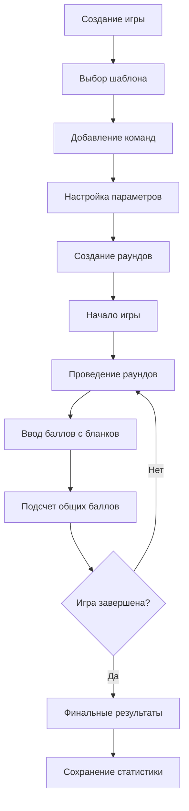

# 🎮 Правильный Квиз - Описание проекта

> **Система управления интеллектуальными играми и викторинами**

## 📋 Обзор проекта

**Правильный Квиз** — это современная веб-платформа для проведения интеллектуальных игр, викторин и турниров с поддержкой команд, автоматического подсчета баллов и real-time табло для зрителей.

### 🎯 Основная цель
Создать универсальную систему для организации и проведения интеллектуальных игр с возможностью:
- Создания игр из готовых шаблонов
- Управления командами-участниками
- Ввода баллов с бланков ответов команд
- Отображения результатов в реальном времени
- Анализа статистики и результатов

## 🏢 Бизнес-требования

### 👥 Целевая аудитория

#### Основные пользователи:
1. **Организаторы игр** (администраторы)
   - Создают и настраивают игры
   - Управляют командами
   - Вводят баллы с бланков ответов команд
   - Контролируют процесс игры

2. **Зрители** (публичный доступ)
   - Просматривают табло в реальном времени
   - Следят за результатами команд
   - Не требуют регистрации

3. **Команды-участники**
   - Участвуют в играх
   - Заполняют бланки ответов
   - Соревнуются за призовые места

### 🎯 Бизнес-цели

#### Краткосрочные (MVP):
- ✅ Автоматизация процесса подсчета баллов
- ✅ Устранение ошибок в подсчете результатов
- ✅ Ускорение процесса проведения игр
- ✅ Улучшение зрительского опыта

#### Долгосрочные:
- 📊 Аналитика и статистика игр
- 🏆 Система рейтингов команд
- 📱 Мобильное приложение
- 🌐 Многоязычная поддержка

## 🔧 Функциональные требования

### 🎮 Управление играми

#### Создание игры:
- Выбор шаблона игры из библиотеки
- Настройка параметров игры (дата, название)
- Добавление команд-участников
- Автоматическое создание раундов по шаблону

#### Проведение игры:
- Переключение между раундами
- Ввод баллов с бланков ответов команд
- Автоматический подсчет общих баллов
- Корректировка результатов при необходимости

#### Завершение игры:
- Подсчет финальных результатов
- Определение победителей
- Сохранение статистики игры

### 👥 Управление командами

#### Справочник команд:
- Создание и редактирование команд
- Загрузка логотипов команд
- Контактная информация
- История участия в играх

#### Участие в играх:
- Регистрация команд на игру
- Назначение номеров столов
- Отслеживание результатов

### 📊 Система подсчета баллов

#### Процесс ввода баллов:
- Администратор получает бланки ответов от команд
- Вводит баллы за каждый раунд для каждой команды
- Система автоматически суммирует общие баллы
- Возможность корректировки результатов администратором

### 📺 Real-time табло

#### Публичное табло:
- Отображение текущих результатов всех команд
- Обновление в реальном времени
- Сортировка по количеству баллов
- Отображение текущего раунда

#### Административная панель:
- Детальная статистика по командам
- История изменений баллов
- Управление статусом игры

## 🏗️ Техническая архитектура

### 🖥️ Frontend (React + TypeScript)
- **Административная панель**: управление играми, командами, ввод баллов
- **Публичное табло**: отображение результатов для зрителей
- **Адаптивный дизайн**: поддержка всех устройств
- **Real-time обновления**: WebSocket соединения

### ⚙️ Backend (Node.js + Express)
- **REST API**: управление данными игр и команд
- **WebSocket сервер**: real-time обновления табло
- **Аутентификация**: JWT токены для администраторов
- **Валидация данных**: проверка корректности ввода

### 🗄️ База данных (PostgreSQL)
- **Основные сущности**: игры, команды, раунды, ответы
- **Связи между данными**: внешние ключи и индексы
- **Транзакции**: обеспечение целостности данных

## 📈 Бизнес-процессы

### 🔄 Жизненный цикл игры

### 👥 Роли и права доступа

#### Администратор:
- ✅ Создание и управление играми
- ✅ Управление командами
- ✅ Ввод баллов с бланков ответов
- ✅ Корректировка результатов
- ✅ Просмотр аналитики

#### Зритель (публичный доступ):
- ✅ Просмотр табло игр
- ✅ Отслеживание результатов в реальном времени
- ❌ Нет доступа к административным функциям

## 📊 Ключевые метрики

### 🎯 Операционные метрики:
- Количество проведенных игр
- Количество активных команд
- Среднее время проведения игры
- Количество зрителей на табло

### 🔧 Технические метрики:
- Время отклика API
- Доступность системы (uptime)
- Количество одновременных подключений
- Производительность базы данных

## 🚀 Планы развития

### 📅 Фаза 1 (MVP) - 2 месяца
- ✅ Базовая функциональность игр
- ✅ Простое табло результатов
- ✅ Управление командами
- ✅ Система подсчета баллов

### 📅 Фаза 2 - 2 месяца
- 📱 Мобильная версия
- 📊 Расширенная аналитика
- 🎨 Кастомизация интерфейса
- 🔐 Улучшенная безопасность

### 📅 Фаза 3 - 3 месяца
- 🌐 Многоязычность
- 🔗 API для интеграций
- ⚡ Масштабирование архитектуры
- 🤖 Автоматизация процессов

## 🎯 Уникальные особенности

### 💡 Ключевые особенности:
1. **Простота использования**: интуитивный интерфейс для организаторов
2. **Real-time обновления**: мгновенное отображение результатов
3. **Гибкость настройки**: различные типы вопросов и подсчета баллов
4. **Масштабируемость**: поддержка от малых до крупных мероприятий
5. **Открытость**: публичный доступ к табло без регистрации

## 📋 Риски и ограничения

### ⚠️ Технические риски:
- Зависимость от интернет-соединения
- Производительность при большом количестве пользователей
- Безопасность данных пользователей

### 💼 Бизнес-риски:
- Необходимость обучения пользователей
- Изменение требований пользователей

### 🛡️ Меры по снижению рисков:
- Резервное копирование данных
- Мониторинг производительности
- Регулярные обновления безопасности
- Обратная связь с пользователями

## 📞 Контакты и поддержка

### 👥 Команда проекта:
- **Product Owner**: определение требований и приоритетов
- **Tech Lead**: архитектурные решения и техническое руководство
- **Backend Developer**: разработка API и бизнес-логики
- **Frontend Developer**: пользовательский интерфейс
- **DevOps Engineer**: инфраструктура и развертывание

### 📧 Поддержка:
- **Email**: support@pravilniy-quiz.com
- **Документация**: [GitHub Wiki](https://github.com/quiz-game-team/quiz-game/wiki)
- **Issues**: [GitHub Issues](https://github.com/quiz-game-team/quiz-game/issues)

---

## 🎉 Заключение

**Правильный Квиз** представляет собой современное решение для организации интеллектуальных игр, которое сочетает в себе простоту использования, функциональность и технологическую надежность. Проект направлен на автоматизацию и улучшение процесса проведения викторин, обеспечивая лучший опыт как для организаторов, так и для участников игр.

Система построена на современных технологиях и следует лучшим практикам разработки, что обеспечивает ее масштабируемость, безопасность и простоту сопровождения. Архитектура позволяет легко добавлять новые функции и адаптироваться к изменяющимся требованиям пользователей.

> 💡 **Цель проекта**: Сделать проведение интеллектуальных игр простым, быстрым и увлекательным для всех участников процесса.
